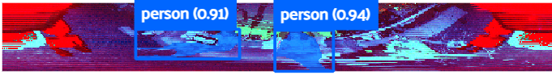
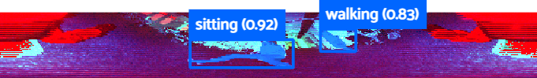

# Person Segmentation LiDAR

Supplementary code and training data for the wide FoV person segmentation approach. The paper can be found [here](https://arxiv.org/abs/2411.11151).

The training code is seperated for different tasks:

* Person Detection --> `person_detection.ipynb`
* Action Detection --> `action_detection.ipynb`
* Inference code --> `test_tiago.ipynb`

## Data and Models

* [Data](https://www.ais.uni-bonn.de/data/lidar_person_action_detection/data.zip) 
* [Pre-trained Models](https://www.ais.uni-bonn.de/data/lidar_person_action_detection/models.zip) 

The dataset are contained in separate sub-folders inside the `images` folder depending on the corresponding experiment set. The data is provided with annotations in the COCO format.
